<p align="center">
  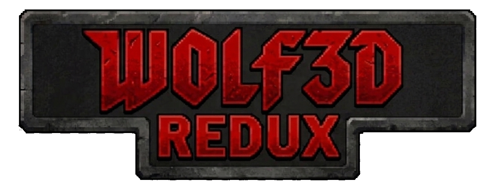
</p>

<h1 align="center"><!--<em>Wolf3D Redux</em>--></h1>

***Wolf3D Redux*** (originally named ***DDWolf***) aims at bringing modern improvements to the ***Wolf4SDL*** engine while still preserving the game as pure and close to the original as possible.

Please look at the **bottom** of this page for **credits and special thanks!**

<p align="center">
  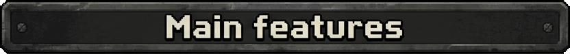
</p>

* HD resolution support & Display menu
	- Display resolution & options menu.
  - Supports any resolutions.
    - Resolution change keeps aspect ratio in every display mode.
    - Interface/game scales accordingly.
  - Enable/Disable Fullscreen (exclusive & windowed mode).
  - Enable/Disable VSync.
* Modern control scheme
  - WASD controls.
  - Can disable mouse Y axis.
  - #MODERN_CONTROL flag in version.h to enable or disable.
    - Original control scheme available.
* Better controller support
  - Left analog stick : Move/Strafe
  - Right analog stick : Rotate
  - Left / Right shoulders : Previous and Next weapon
  - Back/Start Button
  - 4 Action Buttons (Can be remapped)
    - A : Fire
    - B : Strafe (mapped to key but not useful for now with controller)
    - Y : Run
    - X : Open door
* AlumiuN's Advanced Sound Manager
  - Some modifications by WSJ.
  - No sounds included.
  - Disabled by default.

<p align="center">
  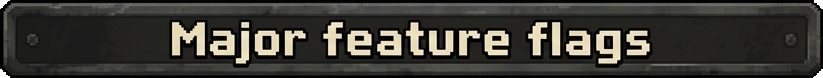
</p>

```
#USE_MODERN_CONTROLS                  Modern WASD control scheme.

#VIEASM                               AlumiuN's Advanced Sound Manager

#SHOW_ATMOS_OPTIONS                   Enables a menu that gives the player control over
                                      what visual options are enabled/disabled at runtime.
                                      Textured floor & ceiling, Shading, Skybox and Precipitation

#SHOW_CUSTOM_CONTROLS                 Enables a menu with an additional 10 custom actions
                                      that can be mapped to a keyboard key.
                                      Custom actions needs to be implemented by modder.

See version.h for all available flags.
```

<p align="center">
  
</p>

The following versions of Wolfenstein 3D data files are currently supported by the source code (choose the version by commenting/uncommenting lines in version.h as described in that file)
```
- Wolfenstein 3D v1.1 full Apogee
- Wolfenstein 3D v1.4 full Apogee
- Wolfenstein 3D v1.4 full GT/ID/Activision
- Wolfenstein 3D v1.0 shareware Apogee
- Wolfenstein 3D v1.1 shareware Apogee
- Wolfenstein 3D v1.2 shareware Apogee
- Wolfenstein 3D v1.4 shareware
- Spear of Destiny full
- Spear of Destiny demo
- Spear of Destiny - Mission 2: Return to Danger
- Spear of Destiny - Mission 3: Ultimate Challenge
```

<p align="center">
  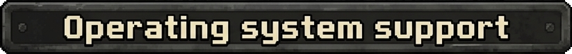
</p>

```
- Windows 98*
- Windows ME*
- Windows 2000*
- Windows XP*ish?
- Windows Vista (32 and 64 bits)
- Windows 7 (32 and 64 bits)
- Windows 10 (32 and 64 bits)
- Windows 11 (32 and 64 bits)
- Linux - [Game runs 100%, been tested, but build system might be broken]

* SDL1 support only, which is not supported for the moment, but planned to be reimplemented.
```

<p align="center">
  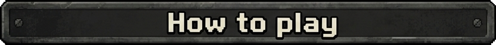
</p>

To play Wolfenstein 3D with Wolf3D Redux, you just have to copy the original data files (e.g. *.WL6) into the same directory as the Wolf3D Redux executable.

Please make sure, that you use the correct version of the executable with the according data files version as the differences are hardcoded into the binary!

You also need to have SDL2.dll (2.30.7) and SDL_Mixer.dll (2.8.0) in the same directory as the EXE.

If you want to release or grab the mouse, press SCROLLLOCK or F12 to alternate between the two options.

<p align="center">
  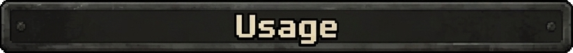
</p>

Wolf3D Redux supports the following command line options
```
 --help                           This help page
 --tedlevel <level>               Starts the game in the given level
 --baby                           Sets the difficulty to baby for tedlevel
 --easy                           Sets the difficulty to easy for tedlevel
 --normal                         Sets the difficulty to normal for tedlevel
 --hard                           Sets the difficulty to hard for tedlevel
 --nowait                         Skips intro screens
 --bits <b>                       Sets the screen color depth (Use this when you have palette/fading problem or perhaps to optimize speed on old systems.)
                                  Allowed: 8, 16, 24, 32, default: "best" depth.
                                  (unit is currently 8 ms, default: 0)
 --joystick <index>               Use the index-th joystick if available
 --joystickhat <index>            Enables movement with the given coolie hat
 --samplerate <rate>              Sets the sound sample rate (given in Hz)
 --audiobuffer <size>             Sets the size of the audio buffer (-> sound latency, given in bytes)
 --ignorenumchunks                Ignores the number of chunks in VGAHEAD.* (may be useful for some broken mods)
 --configdir <dir>                Directory where config file and save games are stored (Windows default: current directory, others: $HOME/.Wolf3D-Redux)

= Additional launch parameters =

AlumiuN's Advanced Sound Manager
--nosound                         Turns off sound
--8bitsound                       Sets the sound to 8 bits (default 16 bits)

Spear of Destiny
--mission <mission>               Mission number to play (1-3)
--goodtimes                       Disable copy protection quiz
```

<p align="center">
  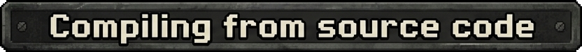
</p>

The current version of the source code is available on GitHub at: https://github.com/brosseaualex/Wolf3D-Redux

**_What you need:_**

- C++ Compiler
- SDL 2 Libraries

**_Preferred methods for compiling the source code_**

- Code::Blocks 20.03 - ***Supported***
  - Wolf3D-Redux_x86.cbp (Requires 32-bits compiler)
  - Wolf3D-Redux_x64.cbp (Requires 64-bits compiler)
    - README-codeblocks.txt
- Visual Studio C++ (2019/2022) - ***Supported***
  - [VS 2022] - Wolf3D-Redux.VC2022.sln
  - [VS 2019] - Wolf3D-Redux.VC2019.sln
    - README-VC.txt
- [CLion] CMakeList (Tested with MingW) - ***No support provided***
- [Outdated] Makefile (for Linux, BSD variants and MinGW/MSYS) - ***No support provided***

<p align="center">
  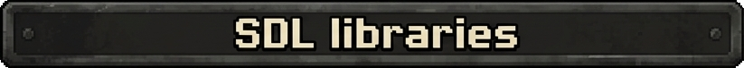
</p>

Batch files that automatically downloads and places the correct SDL2 and SDL2_Mixer libraries in the required folders are included in the repository.

You only need to run the script and open the project you want to use.

<p align="center">
  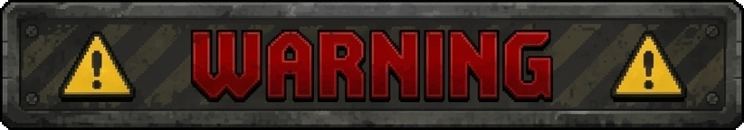
</p>

*This script **DOES NOT WORK** with admin privileges (Run as administrator), make sure to clone the repository somewhere where elevation is **NOT** required.*

*Tested in a directory under 'C:\Users\Username'.*

<p align="center">
  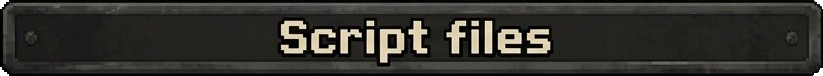
</p>

```
- _get-libs-mingw.bat (Code::Blocks/MingW libraries)
- _get-libs-vc.bat (Visual Studio libraries)
```

The SDL and SDL_Mixer versions used in this project are the following :
- SDL2 2.30.7 (https://www.libsdl.org/release/)
- SDL2_mixer 2.8.0 (https://www.libsdl.org/projects/SDL_mixer/release/)

<p align="center">
  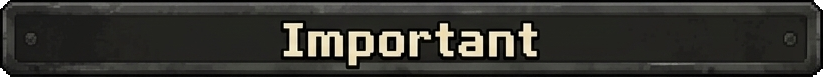
</p>

Do not forget to take care of version.h!

By default it compiles for "Wolfenstein 3D 1.4 full GT/ID/Activision"!

**_Certain flags REQUIRE CONFIG.WL6 to be DELETED every time the flag is changed._**

Those flags are explicitely tagged in version.h

**_The game will crash on start or there will be issues with controls if config.wl6 is not deleted._**

<p align="center">
  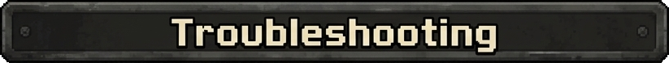
</p>

- Crash on startup or issues with controls after flag change
  - Delete CONFIG.WL6
- Low frame rate
  - Consider using the original screen resolution (320x200) or lowering the sound quality (--samplerate 22050)

<p align="center">
  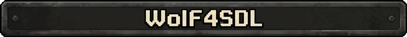
</p>

Wolf4SDL is an open-source port of id Software's classic first-person shooter Wolfenstein 3D to the cross-platform multimedia library "Simple DirectMedia Layer (SDL)" (http://www.libsdl.org).

The overall work to get to where we are would not be possible without the following people, more credits at the end of the readme.

- Original Wolfenstein 3D by id Software (http://www.idsoftware.com)
- Wolf4SDL by Moritz "Ripper" Kroll (http://www.chaos-software.de.vu - OFFLINE)
- Modifications to r262 by Andy_Nonymous and others (http://diehardwolfers.areyep.com/viewtopic.php?t=6693)


<p align="center">
  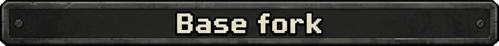
</p>

***Wolf3D Redux*** is based on the official ***Wolf4SDL*** fork currently maintained by KS-Presto.

***Wolf4SDL*** is available [HERE](https://bitbucket.org/ks-presto/wolf4sdl/src/master/) (Bitbucket).

<p align="center">
  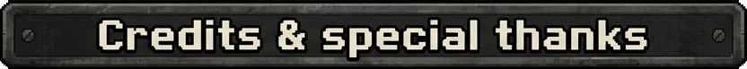
</p>

- Special thanks to id Software! Without the source code we would still have to pelt Wolfenstein 3D with hex editors and disassemblers ;D
- Special thanks to the DOSBox team for providing a GPL'ed OPL2/3 emulator!
- Special thanks to the MAME developer team for providing the source code of the OPL2 emulator!
- Many thanks to "Der Tron" for hosting the svn repository, making Wolf4SDL FreeBSD compatible, testing, bugfixing and cleaning up the code!
- Thanks to Chris Chokan for his improvements on Wolf4GW (base of Wolf4SDL)!
- Thanks to Pickle for the GP2X support and help on 320x240 support!
- Thanks to fackue for the Dreamcast support!
- Thanks to Chris Ballinger for the Mac OS X support!
- Thanks to Xilinx, Inc. for providing a list of maximum-length LFSR counters used for higher resolutions of fizzle fade!

<p align="center">
  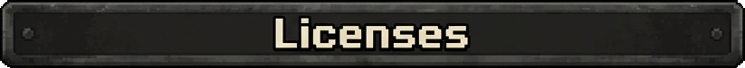
</p>

- The original source code of Wolfenstein 3D (at your choice) :
  - license-id.txt
  - license-gpl.txt
- SDL
  - license-sdl.txt
- SDL_Mixer
  - license-sdl_mixer.txt
- The OPL2 emulator (at your choice) :
  - license-mame.txt (fmopl.cpp)
  - license-gpl.txt (dbopl.cpp, USE_GPL define in version.h or set GPL=1 for Makefile)